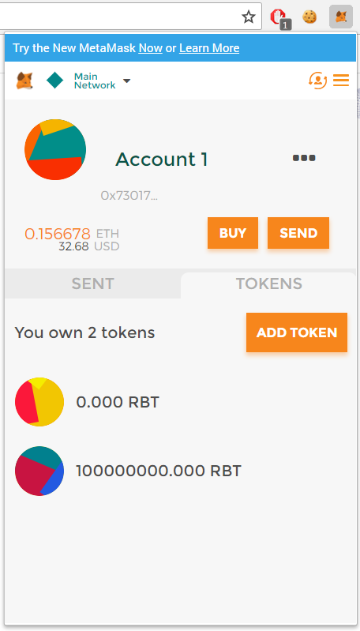

# [📝 Simple Cryptocurrency ERC 20 Token Template 📝](https://etherscan.io/token/0x5ab70ade9d30869bdbdc9f9eb71caf3853abb9d1?a=0x73017613f8e551fb3026e8945fa8a499f44aab36#readContract)
Very Simple **ERC-20 Smart Contract** on the **Ethereum Blockchain**, with many customizable Options to create a **useable Cryptocurrency**.</br>
***Ready to deploy Ethereum Smart Contract***

## ❓ How can I use it? ❓

**The Example Smart Contract is already filled with values, the only thing you need to do is to customize these values with the attributes you want for your Cryptocurrency** look at the ***Example*** below: ⬇️⬇️⬇️

```
function Robot(){

        // Give the creator all initial tokens (100000000000000000000000000 for example)
        balances[msg.sender] = 100000000000000000000000000; 
        
        // Update total supply (100000000000000000000000000 for example)
        totalSupply = 100000000000000000000000000; 
        
        // Set the name for display purposes
        name = "Robot"; 
        
        // Amount of decimals for display purposes
        decimals = 18;  
        
        // Set the symbol for display purposes
        symbol = "RBT"; 
        
}
```

***These are the only attributes you need to change in the Smart Contract, to customize your Cryptocurrency and then you can already deploy your Smart Contract on the Ethereum Blockchain.*** 💎 </br>
*Tip: The created **Cryptocurrency** goes into the wallet where the **Smart Contract** was deployed*.

## 🖼 Images 🖼

### 🦊 MetaMask 🦊



### [💎 Etherscan 💎](https://etherscan.io/token/0x5ab70ade9d30869bdbdc9f9eb71caf3853abb9d1?a=0x73017613f8e551fb3026e8945fa8a499f44aab36#readContract) 

**Link : [https://etherscan.io/token/0x5ab70ade9d30869bdbdc9f9eb71caf3853abb9d1?a=0x73017613f8e551fb3026e8945fa8a499f44aab36#readContract](https://etherscan.io/token/0x5ab70ade9d30869bdbdc9f9eb71caf3853abb9d1?a=0x73017613f8e551fb3026e8945fa8a499f44aab36#readContract)**

_Token.png)

## [📝 Code 📝](https://github.com/AYIDouble/Simple-Cryptocurrency-ERC-20-Token-Template/blob/master/solidity/contracts/SmartContractCode.sol)

**Link : [https://github.com/AYIDouble/Simple-Cryptocurrency-ERC-20-Token-Template/blob/master/solidity/contracts/SmartContractCode.sol](https://github.com/AYIDouble/Simple-Cryptocurrency-ERC-20-Token-Template/blob/master/solidity/contracts/SmartContractCode.sol)**
### SmartContractCode.sol
```
pragma solidity ^0.4.4;

contract Token {

    /// @return total amount of tokens
    function totalSupply() constant returns (uint256 supply) {}

    /// @param _owner The address from which the balance will be retrieved
    /// @return The balance
    function balanceOf(address _owner) constant returns (uint256 balance) {}

    /// @notice send `_value` token to `_to` from `msg.sender`
    /// @param _to The address of the recipient
    /// @param _value The amount of token to be transferred
    /// @return Whether the transfer was successful or not
    function transfer(address _to, uint256 _value) returns (bool success) {}

    /// @notice send `_value` token to `_to` from `_from` on the condition it is approved by `_from`
    /// @param _from The address of the sender
    /// @param _to The address of the recipient
    /// @param _value The amount of token to be transferred
    /// @return Whether the transfer was successful or not
    function transferFrom(address _from, address _to, uint256 _value) returns (bool success) {}

    /// @notice `msg.sender` approves `_addr` to spend `_value` tokens
    /// @param _spender The address of the account able to transfer the tokens
    /// @param _value The amount of wei to be approved for transfer
    /// @return Whether the approval was successful or not
    function approve(address _spender, uint256 _value) returns (bool success) {}

    /// @param _owner The address of the account owning tokens
    /// @param _spender The address of the account able to transfer the tokens
    /// @return Amount of remaining tokens allowed to spent
    function allowance(address _owner, address _spender) constant returns (uint256 remaining) {}

    event Transfer(address indexed _from, address indexed _to, uint256 _value);
    event Approval(address indexed _owner, address indexed _spender, uint256 _value);
    
}


contract StandardToken is Token {

    function transfer(address _to, uint256 _value) returns (bool success) {
        //Default assumes totalSupply can't be over max (2^256 - 1).
        //If your token leaves out totalSupply and can issue more tokens as time goes on, you need to check if it doesn't wrap.
        //Replace the if with this one instead.
        //if (balances[msg.sender] >= _value && balances[_to] + _value > balances[_to]) {
        if (balances[msg.sender] >= _value && _value > 0) {
            balances[msg.sender] -= _value;
            balances[_to] += _value;
            Transfer(msg.sender, _to, _value);
            return true;
        } else { return false; }
    }

    function transferFrom(address _from, address _to, uint256 _value) returns (bool success) {
        //same as above. Replace this line with the following if you want to protect against wrapping uints.
        //if (balances[_from] >= _value && allowed[_from][msg.sender] >= _value && balances[_to] + _value > balances[_to]) {
        if (balances[_from] >= _value && allowed[_from][msg.sender] >= _value && _value > 0) {
            balances[_to] += _value;
            balances[_from] -= _value;
            allowed[_from][msg.sender] -= _value;
            Transfer(_from, _to, _value);
            return true;
        } else { return false; }
    }

    function balanceOf(address _owner) constant returns (uint256 balance) {
        return balances[_owner];
    }

    function approve(address _spender, uint256 _value) returns (bool success) {
        allowed[msg.sender][_spender] = _value;
        Approval(msg.sender, _spender, _value);
        return true;
    }

    function allowance(address _owner, address _spender) constant returns (uint256 remaining) {
      return allowed[_owner][_spender];
    }

    mapping (address => uint256) balances;
    mapping (address => mapping (address => uint256)) allowed;
    uint256 public totalSupply;
}


//name this contract whatever you'd like
contract Robot is StandardToken {

    function () {
        //if ether is sent to this address, send it back.
        throw;
    }

    /* Public variables of the token */

    /*
    NOTE:
    The following variables are OPTIONAL vanities. One does not have to include them.
    They allow one to customise the token contract & in no way influences the core functionality.
    Some wallets/interfaces might not even bother to look at this information.
    */
    string public name;                   //fancy name: eg Simon Bucks
    uint8 public decimals;                //How many decimals to show. ie. There could 1000 base units with 3 decimals. Meaning 0.980 SBX = 980 base units. It's like comparing 1 wei to 1 ether.
    string public symbol;                 //An identifier: eg SBX
    string public version = '1.1.3';       //human 0.1 standard. Just an arbitrary versioning scheme.

//
// CHANGE THESE VALUES FOR YOUR TOKEN
//

//make sure this function name matches the contract name above. So if you're token is called TutorialToken, make sure the //contract name above is also TutorialToken instead of ERC20Token

    function Robot(
        ) {
        balances[msg.sender] = 100000000000000000000000000;               // Give the creator all initial tokens (100000 for example)
        totalSupply = 100000000000000000000000000;                        // Update total supply (100000 for example)
        name = "Robot";                                   // Set the name for display purposes
        decimals = 18;                            // Amount of decimals for display purposes
        symbol = "RBT";                               // Set the symbol for display purposes
    }

    /* Approves and then calls the receiving contract */
    function approveAndCall(address _spender, uint256 _value, bytes _extraData) returns (bool success) {
        allowed[msg.sender][_spender] = _value;
        Approval(msg.sender, _spender, _value);

        //call the receiveApproval function on the contract you want to be notified. This crafts the function signature manually so one doesn't have to include a contract in here just for this.
        //receiveApproval(address _from, uint256 _value, address _tokenContract, bytes _extraData)
        //it is assumed that when does this that the call *should* succeed, otherwise one would use vanilla approve instead.
        if(!_spender.call(bytes4(bytes32(sha3("receiveApproval(address,uint256,address,bytes)"))), msg.sender, _value, this, _extraData)) { throw; }
        return true;
    }
}
```
